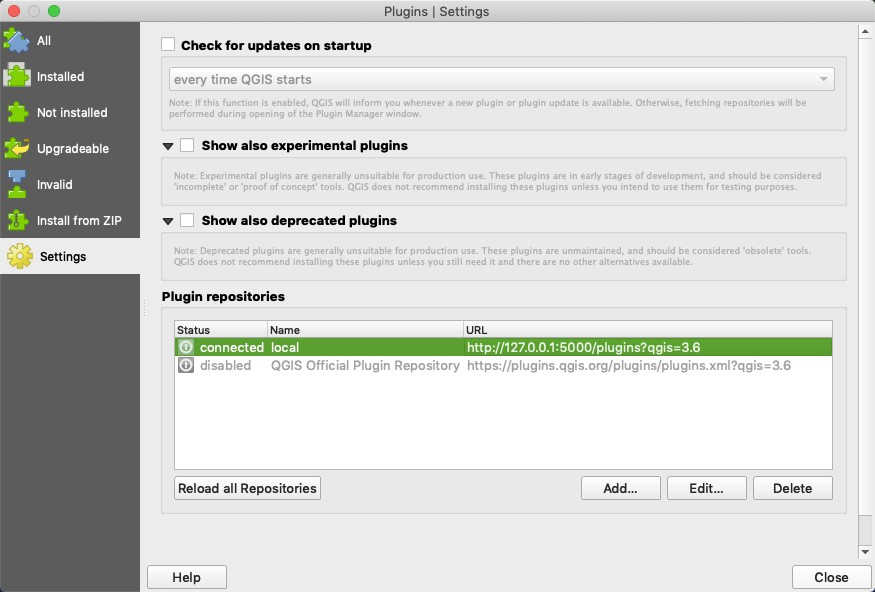
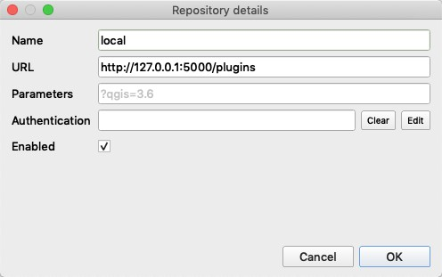

## QGIS plugins local server

QGIS repostories is too slow when loading from some country. This repo can run local server and get the repo lists very fast.


### requirements
- flask

### how to use
1. run the server at local environment

    ``` bash
    git clone https://github.com/sshuair/qgis-plugins-local-server.git
    cd qgis-plugins-local-server
    python3 run.py
    ```

1. modify the QGIS plugins repostories
   
    open the qgis --> `plugins` --> `manage and install plugins.` --> `settings` --> `add plugins repostories`

    the plugins repostories URL should be `http://127.0.0.1:5000/plugins`

    then right click the local item choose `Only show plugins from the selected repostories` will successful load the all repostories.



